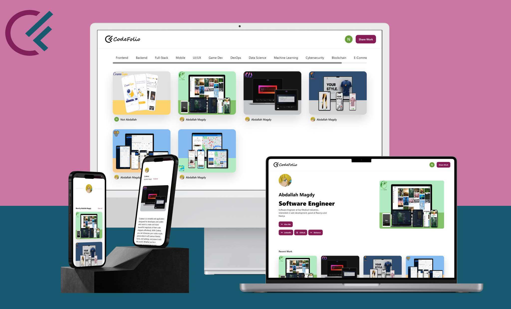

<div align="center">
  
</div>

# Codefolio

Codefolio: Showcase your coding prowess with style. Share and discover developer projects, each presented with eye-catching posters and categorized for easy exploration. Elevate your portfolio in the coding community. Start building your digital footprint today.

## Demo

Codefolio is deployed to Vercel. You can try it on the following URL: [codefolio-app.vercel.app](https://codefolio-app.vercel.app/).

<div align="center">
  
</div>

## Technologies Used

- React.js
- Next.js 13
- TypeScript
- Tailwind
- Grafbase

## Installation

To install and run Codefolio locally, follow these steps:

1. Clone the project repository.
2. Install the necessary dependencies by running the following command:

```
npm install
```

4. Replace the environment variables with your own API keys.
5. Run Grafbase by running the following command

```
grafbase dev
```

5. Run the project by executing the following command:

```
npm run dev
```

6. Access the application by visintg http://localhost:3000/
